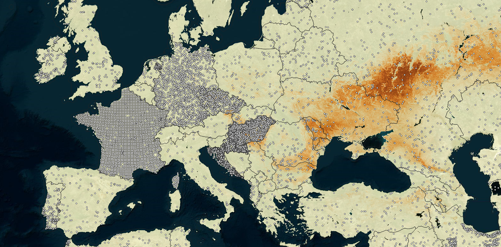
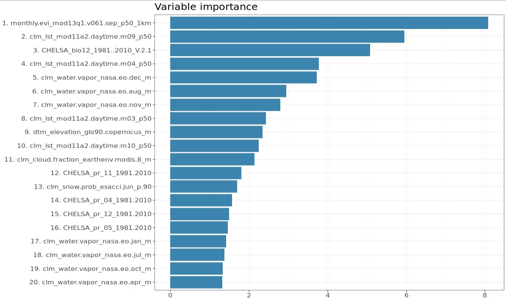

```{r setup, include=FALSE}
knitr::opts_chunk$set(echo = TRUE)
```

```{r, include=FALSE, message=FALSE, results='hide'}
ls <- c("rgdal", "raster", "terra", "ranger", "sf", "randomForestSRC", "ggplot2")
new.packages <- ls[!(ls %in% installed.packages()[,"Package"])]
if(length(new.packages)) install.packages(new.packages)
lapply(ls, require, character.only = TRUE)
```

[](https://doi.org/10.5281/zenodo.7820796)

## Soil types

[Soil type](https://en.wikipedia.org/wiki/Soil_type) is a result of technical classification of a soil site. 
Soil type typically reflects commons soil properties, soil stratification / 
soil horizons, diagnostic features, sometimes also soil-forming factors such as 
climate and hydrological conditions. Unlike with biology and species taxonomy, soil types are abstract and 
often subjective, i.e. are not always easy to validate using laboratory measurements. 
In that sense, soil classification can be best compared to classification of climate (e.g. [Köppen climate classification](https://en.wikipedia.org/wiki/K%C3%B6ppen_climate_classification)) and [biomes](https://en.wikipedia.org/wiki/Biome).

Knowing the soil type of your land can be fairly useful as a soil type conveys 
complex multivariate information and are ideal summaries of soil. Soil types are used as input to 
crop-yield modeling, land use management planning and landscape modeling of natural hazards 
and similar. Soils can be classified using the classification manuals e.g. 
FAO's IUSS's [World Reference Base (WRB) manual](https://www.fao.org/soils-portal/data-hub/soil-classification/world-reference-base/en/) 
and/or [USDA Keys to Soil Taxonomy](https://www.nrcs.usda.gov/resources/guides-and-instructions/keys-to-soil-taxonomy) (KST). 
What somewhat adds to complexity of using soil classification is that many countries 
have their own classification systems (in a local language), but often national soil types 
can be **correlated to some international system** e.g. WRB or KST [@krasilnikov2009handbook, @Verweij2017]. 
Correlation is not ideal and hence it is good to consider that one soil type in a local 
system could be translated to at least 2 or 3 soil types in the international (target) system.

In this computational notebook we show how to globally map soil types, how to access 
the [predictions we produced](https://doi.org/10.5281/zenodo.7820796) (GB of data), and how 
to further learn about your own soil. These predictions will be continuously updated, 
so if you see an artifact or an issue, please report.

## Mapping soil types using legacy soil observations

Soil types can be mapped from (legacy) soil observations and measurements (O&M), especially 
by using those O&M's that include full or partial soil profile descriptions [@hengl2017soilgrids250m, @poggio2021soilgrids]. 
Here we are only interested in the global compilations of soil observations that 
come with harmonized _analysis-ready_ soil type designations and which are geolocated. For example 
the World Soil Information Service (WoSIS) soil profile database (available via: 
https://www.isric.org/explore/wosis) contains over 30,000 profiles with soil classification [@batjes2020standardised] 
and can be considered one of the most consistent global soil profile compilations.

A disadvantage of using only legacy soil profiles, however, is that these are often 
spatially clustered i.e. large gaps exists where almost no data available. This applies especially 
for African and Asian continents. To increase spatial coverage of the training points for 
global soil type mapping, we can add points generated from the global soil polygon map 
e.g. [Harmonized World Soil Database](https://iiasa.ac.at/models-tools-data/hwsd) (HWSD) [@hwsd2023]. 
The HWSDv2 contains also the WRB 2022 version soil types per mapping unit, but these are 
potentially of variable accuracy and should be only used to fill gaps in training data.

In addition to WoSIS and HWSDv2, we can also add some additional points coming 
from the land-surface observations e.g. to represent shifting sand and bare-rock areas. 
Global land cover validation data sets that are produced by photo-interpretation of 
very high resolution satellite imagery (e.g. 20 cm resolution) often contain 
useful observations of the shifting sand, permanent ice and bare-rocks [@tsendbazar2021towards].
These specific surface materials are often missing in the legacy soil profile datasets.

To produce the soil type predictions at 1 km spatial resolution, we have hence decided to use 
a combination of the legacy soil profiles, surface-cover observations and simulated points 
from the HWSDv2. This gave us about 70,000 training points in total (see figure below). 
Although there are still some potential issues with some countries being over-represented, 
the final training data set can be considered spatially complete and representative.

```{r soil-pnts, echo=FALSE, fig.cap="Training points used for global soil type mapping.", out.width="100%"}

```

As covariate layers for soil type mapping, we use the common global, (primarily remote sensing based) 
global layers including:

- Digital Terrain Model parameters based on the MERIT DTM and [MERITHydro](http://hydro.iis.u-tokyo.ac.jp/~yamadai/MERIT_Hydro/),
- [Global Lithological DB GLiM and landform units](https://doi.org/10.5281/zenodo.1447198),
- [CHELSA Climate bioclimatic layers](https://chelsa-climate.org/bioclim/),
- Long-term MODIS time-series day-time and night-time [Land Surface Temperature (LST)](https://doi.org/10.5281/zenodo.1420114),
- Long-term MODIS monthly EVI,
- Long-term [monthly snow probability images](https://doi.org/10.5281/zenodo.5774953),
- Long-term NASA's [NEO Water vapor images](https://neo.gsfc.nasa.gov/view.php?datasetId=MODAL2_M_SKY_WV),
- Long-term [Cloud fraction images from EarthEnv](https://www.earthenv.org/cloud),

After we have imported and harmonized all training points, we run spatial overlay 
using the terra package [@hijmans2019spatial], which can also be run in parallel:

```{r, eval=FALSE}
ov.stat = parallel::mclapply(tif.lst, function(i){
        terra::extract(terra::rast(i), 
        terra::vect(as.matrix(tr.pntsF[,c("longitude", "latitude")]), crs="EPSG:4326"))}, 
        mc.cores=80)
ov.stat = dplyr::bind_cols(lapply(ov.stat, function(i){i[,2]}))
names(ov.stat) = make.names(tools::file_path_sans_ext(basename(tif.lst)))
ov.stat$row.id = tr.pntsF$row.id
wrb.rm = plyr::join_all(list(tr.pntsF, ov.stat))
```

A snapshot of the analysis-ready classification matrix can be loaded from:

```{r}
wrb.rm = readRDS("./data/WRB_global_cm_v20230412.rds")
head(wrb.rm[,1:10])
```

This contains the target variable `h_wrb4`, coordinates of the points + values of 
some 130 covariate layers listed above. The most frequent WRB soil types in the world 
seem to be:

```{r}
summary(as.factor(wrb.rm$h_wrb4), maxsum=10)
```

We can fit a prediction model using this data by running e.g. the randomForestSRC package [@Ishwaran2021]:

```{r, eval=FALSE}
vs.wrb = readRDS("./data/topvars_wrb4.rds")
dfs = wrb.rm[,c("h_wrb4", make.names(vs.wrb$topvars))]
m.test = randomForestSRC::rfsrc(h_wrb4 ~ ., data=dfs, mtry=88, importance=TRUE, ntree=85)
```

To generate predictions, we can use the sample data for the 200 x 200 km tile 
covering part of Hungary:

```{r, eval=FALSE}
g1km = readRDS("./tiles/T9820/data_T9820_1km.rds")
pred = predict(m.test, newdata=g1km@data[,m.test$xvar.names], na.action="na.impute")
probs = as.data.frame(pred$predicted)
```

The variable importance shows that vegetation cover and climate are, in general, 
the main explanatory factors for mapping soil types. Surprisingly landform type and/or 
lithological unit do not come in the top 20 most important covariates.

```{r, eval=FALSE}
library(ggplot2)
feat_imp_df <- m.test$importance %>% 
   data.frame() %>% 
   mutate(feature = row.names(.)) 
# plot dataframe
feat_imp_df$relative_importance = 100*feat_imp_df$all/sum(feat_imp_df$all)
feat_imp_df = feat_imp_df[order(feat_imp_df$relative_importance, decreasing = TRUE),]
feat_imp_df$variable = paste0(1:nrow(feat_imp_df), ". ", sapply(row.names(feat_imp_df), function(i){paste(strsplit(i, "_")[[1]][1:4], collapse="_")}))
ggplot(data = feat_imp_df[1:20,], aes(x = reorder(variable, relative_importance), y = relative_importance)) +
   geom_bar(fill = "steelblue",
            stat = "identity") +
   coord_flip() +
   labs(title = "Variable importance",
        x = NULL,
        y = NULL) +
   theme_bw() + theme(text = element_text(size=15))
```

```{r vimp-taxa, echo=FALSE, fig.cap="Variable importance plot for mapping soil types.", out.width="80%"}

```

For predicting the class probabilities the most important metric is most likely the 
[log-loss](https://stats.stackexchange.com/questions/276067/whats-considered-a-good-log-loss) 
i.e. the average log loss for all classes. 

## How to use these predictions?

You can access all predictions of soil types produced using the training data and 
function listed above directly from [Zenodo](https://doi.org/10.5281/zenodo.7820796). 
All TIF files are provided as [COGs](https://www.cogeo.org/), which means that you can open them directly in 
QGIS or similar. 

You can also query soil types for any longitude latitude using the function below 
(no large data download is needed!):

```{r}
extract_xy = function(x, y, mc.cores=10){
  cogs = read.csv("./layers/WRB2020_maps_1km.csv")
  out = parallel::mclapply(paste0("/vsicurl/", cogs$filename.lst), function(i){terra::extract(terra::rast(i), 
        terra::vect(matrix(c(x, y), ncol = 2), crs="EPSG:4326"))}, mc.cores=mc.cores)
  out = dplyr::bind_cols(lapply(out, function(i){i[,2]}))
  names(out) = make.names(cogs$d.lst)
  return(out)
}
```

Test it on a location in Hungary:

```{r, include=FALSE}
out = extract_xy(x=19.2045, y=46.2251)
```

```{r, eval=FALSE}
out = extract_xy(x=19.2045, y=46.2251)
```

```{r}
out[,which(rank(t(out), ties.method = "random") %in% c(ncol(out)-c(2,1,0)))]
```

This shows that the two most probable soil types at this location are `Haplic.Chernozems` 
or `Luvic.Chernozems`. You can read more about these soils by using the [WRB documents](https://www.fao.org/soils-portal/data-hub/soil-classification/world-reference-base/en/).

Load this function and test predicting soil types for an arbitrary longitude and latitude. 
Find photographs of the soil type you get using some [visual databases](http://www.photosoil.tsu.ru/en/soils?) 
and quickly confirm if the predictions and your field observation match. 

_Note_: we are not mapping ALL soil types that have ever been classified on the field. 
Original list of soil types have been subset to classes that appear at 
least 10 times and at least in 2 countries. If you notice an error or artifact 
please report via the Github repository.

_Disclaimer_: Use at own risk. These are initial results with 
limited accuracy and possible issues with quality of training points, location errors 
and harmonization issues. Update of the predictions takes about 4–5 hrs and will be regularly run provided 
that new training points are available.  

To cite these maps please use:

```
@dataset{hengl_t_2023_7820797,
  author       = {Hengl, T. and Minarik, R.},
  title        = {{Global distribution of predicted soil types at 1 
                   km resolution based on the WRB 2022 classification}},
  year         = 2023,
  publisher    = {OpenGeoHub foundation},
  address      = {Wageningen},
  version      = {v0.1},
  doi          = {10.5281/zenodo.7820797},
  url          = {https://doi.org/10.5281/zenodo.7820797}
}
```

## How to contribute?

Help us make better soil maps of the world: contribute soil observations & 
measurements. If you are a soil point data producer, [register your data](https://opengeohub.github.io/SoilSamples/) and 
then send a note so we can import and add it to the training points.

Test using these maps locally and send us screenshots of potential issues you 
discover. 

The following key improvements are planned in the next release:

- Prediction errors will be provided per pixel for each class probability,
- Finer-resolution covariate layers (up to 100 m spatial resolution) can be added to help increse prediction accuracy,
- [Ensemble ML](https://medium.com/nerd-for-tech/extrapolation-is-tough-for-trees-tree-based-learners-combining-learners-of-different-type-makes-659187a6f58d) i.e. using 3–4 learners instead of a single learner could further help increase accuracy and reduce extrapolation problems,

## Acknowledgments {.unnumbered}

**[EarthMonitor.org](https://EarthMonitor.org/)** project has received funding from 
the European Union's Horizon Europe research an innovation programme under grant 
agreement **[No. 101059548](https://cordis.europa.eu/project/id/101059548)**.

**[AI4SoilHealth.eu](https://AI4SoilHealth.eu/)** project has received funding from 
the European Union's Horizon Europe research an innovation programme under grant 
agreement **[No. 101086179](https://cordis.europa.eu/project/id/101086179)**.

## References {.unnumbered}

